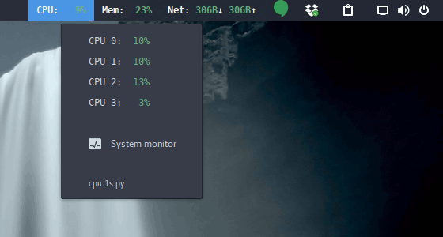
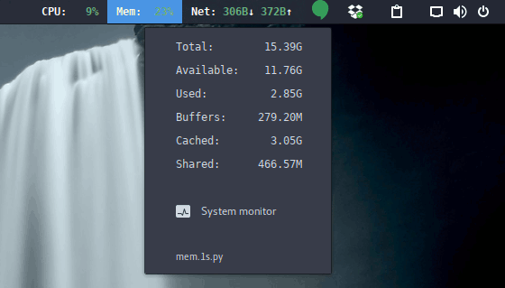
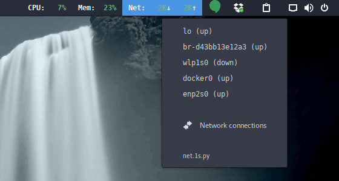

# argos-scripts
Scripts to be used with the excellent
[Argos](https://github.com/p-e-w/argos)
[Gnome-Shell](https://www.gnome.org/gnome-3) extension.

## Scripts
The following scripts are provided:

### CPU monitor: cpu.1s.py
Shows the current CPU usage. When clicked, shows the usage per core.
The percentage is colored according to the CPU usage.
Also shows an entry to run the gnome system monitor.



### Memory monitor: mem.1s.py
Shows the current memory usage.
The percentage is colored according to the memory usage.
When clicked, shows additional memory statistics.
Also shows an entry to run the gnome system monitor.



### Network monitor: net.1s.py
Shows the current network download and upload rates.
The rates are colored according to the download rates.
Feel free to modify the script to adjust the rate to your connection.
When clicked, shows whether each of the available network interfaces
are up or down.
Also shows an entry to run the network connections editor.



## Installation
Checkout this project in some folder, for example, from your `$HOME` folder:
```bash
git clone https://github.com/luisfpg/argos-scripts.git
```
Then link the scripts to the Argos configuration directory:
```bash
mkdir -p $HOME/.config/argos
cd $HOME/.config/argos
ln -s $HOME/argos-scripts/*.py .
```

## Requirements
The scripts require Python 3 with the `psutil` package, which is normally
already installed in most Linux distributions.
